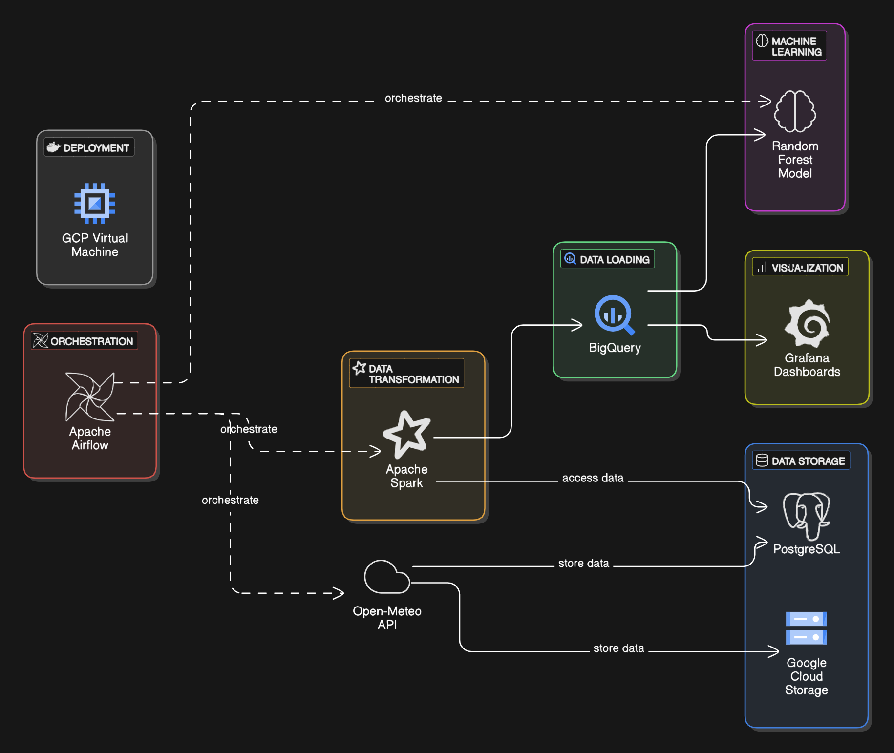

# Solar-Crops-Analysis
**Solar-Crops-Analysis** is an end-to-end Data Engineering and Machine Learning pipeline that leverages weather data to explore the impact of solar energy on agriculture. The project demonstrates complete lifecycle implementation — from data ingestion, transformation, and modeling to dashboarding — all containerized and deployed on a Google Cloud Platform Virtual Machine.

## 🛠️ End-to-End Pipeline Overview

- 🔄 Fetch weather data from Open-Meteo API
- ☁️ Store raw data in **Google Cloud Storage (Parquet)** and **PostgreSQL**
- 🔧 Transform data using **Apache Spark**
- 🚀 Load transformed data into **BigQuery**
- 🧠 Train a **Random Forest Machine Learning model** using data from BigQuery
- 📈 Build **Grafana dashboards** for visual insights
- 🧩 Orchestrate tasks using **Apache Airflow**
- 📦 Containerized using **Docker**
- 🌐 Fully deployed and executed in a **GCP Virtual Machine**

## Project Architecture

Here’s an overview of the project architecture:



---

### 🌾 Crop Data Ingestion

Along with weather data, the project uses historical crop statistics for enhanced analysis and machine learning model training.

#### 📌 Data Source:
The crop data is downloaded from the **ICRISAT District-Level Database**.

#### 📍 Location Chosen:
- **State:** Andhra Pradesh (AP)  
- **District:** Visakhapatnam

#### 🌾 Crops & Features Selected:

We focused on the **Rice** crop and selected the following attributes:

- `RICE_AREA_1000_ha` — Cultivated area (in thousand hectares)  
- `RICE_PRODUCTION_1000_tons` — Production (in thousand tons)  
- `RICE_YIELD_Kg_per_ha` — Yield (in kilograms per hectare)  
- `Year` — Time series data to track trends over years

#### 📤 How It Was Used:
- The data was  uploaded to **BigQuery** as a separate table.
- This dataset was used as part of the **training data** for the **Random Forest Machine Learning model**, where it was joined with weather metrics to enhance predictive capability.

---


## 🛠️ Installation Guide

This guide provides step-by-step instructions to set up and run the Solar Crops Analysis project on a Google Cloud Platform (GCP) Virtual Machine.

---

### ✅ Step 1: Pre-requisites & GCP Setup

#### 🔐 1.1 Create a Service Account

Before creating the VM:

1. Go to **IAM & Admin > Service Accounts** in the GCP Console.
2. Create a new service account and assign the following roles:
  BigQuery Admin,
  BigQuery Data Editor,
  BigQuery Job User,
  BigQuery Read Session User,
  Editor,
  Storage Admin,
  Storage Object Creator,
  Storage Object Viewer
3. While creating the VM (in the next step), **attach this service account** to the instance.
---
### 🌐 Step 2: Configure Firewall Rules

Create firewall rules to allow external access to essential services:

| Port | Purpose            |
|------|--------------------|
| 8080 | Apache Airflow UI  |
| 3000 | Grafana Dashboards |

Set up these rules under **VPC Network > Firewall** with **Ingress** direction.

---

### 🖥️ Step 3: Create a VM Instance

1. Go to **Compute Engine > VM Instances** and click **Create Instance**.
2. Recommended configuration:
- **Name**: `solar-crops-vm`
- **Machine Type**: `e2-standard-2` or higher
- **Boot Disk**: Ubuntu 20.04 LTS
- **Firewall**: Allow HTTP and HTTPS traffic
- **Service Account**: Attach the one created earlier

---
### 🔑 Step 4: Generate and Configure SSH Keys

#### 4.1 On Local Machine

    cd ~/.ssh

    ssh-keygen -t rsa -f solar_key -C your_username

This will generate:

solar_key → Private Key

solar_key.pub → Public Key

#### 4.2 Add Public Key to VM Metadata

Go to Compute Engine > Metadata > SSH Keys and paste the contents of solar_key.pub.

#### 4.3 Connect to the VM

Option 1: Direct command

    ssh -i ~/.ssh/solar_key your_username@<EXTERNAL_IP>

Option 2: SSH config (recommended)

Create a config file ~/.ssh/config:

    Host solar-vm

      HostName <EXTERNAL_IP>
      
      User your_username
      
      IdentityFile ~/.ssh/solar_key
    
Then connect with:

    cd .ssh
    ssh solar-vm

---
### 🐳 Step 5: Install Docker & Docker Compose

#### 5.1 Install Docker

    sudo apt update

    sudo apt install -y docker.io

After installing  to run docker without sudo commands, follow the below github repo

https://github.com/sindresorhus/guides/blob/main/docker-without-sudo.md

#### 5.2 Install Docker Compose

    mkdir bin
    cd bin
    curl -L "https://github.com/docker/compose/releases/download/v2.35.0/docker-compose-linux-x86_64" -o docker-compose
    chmod +x docker-compose
    echo 'export PATH=${HOME}/bin:${PATH}' >> ~/.bashrc
    source ~/.bashrc
    
Verify installation:

    docker --version
    docker-compose --version

---

### 📦 Step 6: Clone the Project Repository

Clone the GitHub repository into your VM:

    git clone https://github.com/muralimittireddy/Solar-Crops-Analysis.git
    cd Solar-Crops-Analysis

---

### Step 7: Replace Environment Variables

Before executing the application, create your own `.env` file and populate it with the values that match your deployment.

- Copy the provided `.env.example` file and rename it to `.env`:

  ```bash
  cp .env.example .env
  ```

- Open the newly created `.env` file and replace the placeholder values with your actual credentials. The variables you need to provide are:

  - `AIRFLOW_PROJ_DIR` – path to the Airflow project directory.
  - `jobs_dir` – path where job scripts reside.
  - `AIRFLOW_UID` – user ID used by Airflow containers.
  - `POSTGRES_USER` – username for the Airflow PostgreSQL database.
  - `POSTGRES_PASSWORD` – password for the Airflow PostgreSQL database.
  - `POSTGRES_DB` – name of the Airflow PostgreSQL database.
  - `APP_POSTGRES_USER` – username for the application PostgreSQL instance.
  - `APP_POSTGRES_PASSWORD` – password for the application PostgreSQL instance.
  - `APP_POSTGRES_DB` – name of the application PostgreSQL database.
  - `APP_POSTGRES_PORT` – port exposed by the PostgreSQL container (typically `5432`).
  - `APP_POSTGRES_HOST` – hostname or container name for PostgreSQL.
  - `GCS_BUCKET_NAME` – Google Cloud Storage bucket where data is stored.
  - `PROJECT_ID` – your Google Cloud project identifier.
  - `BIGQUERY_DATASET` – BigQuery dataset where tables will be created.
  - `DAILY_TABLE` – BigQuery table name for daily weather data.
  - `MONTHLY_TABLE` – BigQuery table name for monthly summaries.
  - `SEASONAL_TABLE` – BigQuery table name for seasonal summaries.
  - `CROP_DATA_TABLE` – BigQuery table name containing crop statistics.
  - `PREDICTION_TABLE` – BigQuery table name used for model predictions.

> **Note**: Keep these credentials private and avoid committing them to version control.

---

### 🚀 Step 8: Run the Project Using Docker Compose

Make sure you're inside the project directory:

    docker-compose up --build
---

### 📊  Step 9: Access the Services

Once the containers are up and running, open your browser and access:

| Service    |                        URL                       |
|------------|--------------------------------------------------|
| Airflow UI | [Apache Airflow UI] (http://<EXTERNAL_IP>:8080)  |
| Grafana    | [Grafana Dashboards] (http://<EXTERNAL_IP>:3000) |

 Replace <EXTERNAL_IP> with your GCP VM’s public IP.

---

 ## 🔌 Airflow Connection Setup

Before triggering the DAG, ensure that the required Airflow connection is configured properly.

### ✅ Spark Connection

The DAG uses a **Spark connection** to run transformations. You need to create this connection in the Airflow UI:

1. Go to the **Airflow Web UI** (usually at `http://<your-vm-ip>:8080`)
2. Click on **Admin > Connections**
3. Click the **+** button to add a new connection
4. Enter the following details:

| Field              | Value                                  |
|--------------------|----------------------------------------|
| **Conn Id**        | `spark_mm`                             |
| **Conn Type**      | `Spark`                                |
| **Host**           | `spark://spark-master`                 |
| **Port**           |  `7077`                                |
| **Extra** (optional) | `{}` or leave empty                  |

> 📝 Note: The connection ID (`spark_mm`) should match the one referenced in your DAG file.

After this step, you're ready to trigger the DAG successfully.

---

## 📊 Grafana Dashboards

This project uses **Grafana** to visualize key metrics and insights from the pipeline.

- **Dashboard Panel 1**: Displays Actual_Yield vs Predicted_Yield and Min_Max Temperatures
- **Dashboard Panel 2**: Shows Average Rainfall (mm) over 51 years.


### Dashboard Details

Created three interactive dashboards in Grafana by connecting to **Google BigQuery** as the data source. These dashboards provide insights into agricultural and weather trends over time.

### 1. Actual Yield vs Predicted Yield
- **Data Source:** `predictions` table in BigQuery
- **Steps:**
  - Configured BigQuery as a data source in Grafana.
  - Wrote SQL to fetch `actual_yield`, `predicted_yield`, and `year` as time.
  - Used a **Time series** panel to plot actual vs predicted yield.
  - Added color differentiation for better visual clarity.

### 2. Min/Max Temperature Trends
- **Data Source:** `daily_weather_data` table in BigQuery
- **Steps:**
  - Queried `min_temperature`, `max_temperature`, and corresponding `date` fields.
  - Used a **Time series** panel to plot both temperature lines over time.
  - Customized axes, labels for better interpretability.

### 3. 51-Year Average Rainfall Analysis
- **Data Source:** `daily_weather_data` table in BigQuery
- **Steps:**
  - Extracted year from the `date` field and calculated `AVG(rainfall)` grouped by month using SQL.
  - Visualized the results using a **Bar chart** panel.
  - Applied formatting for better year-wise rainfall trend analysis.
